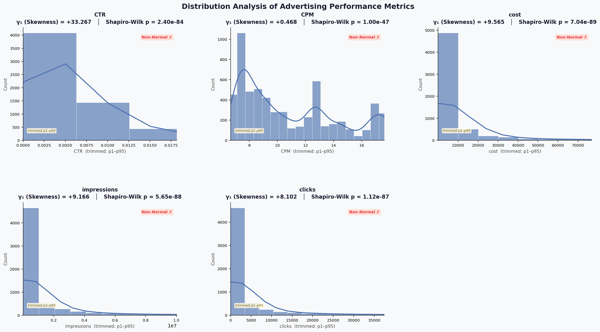
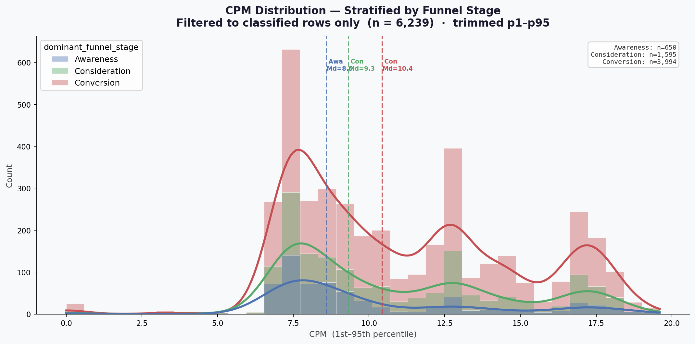
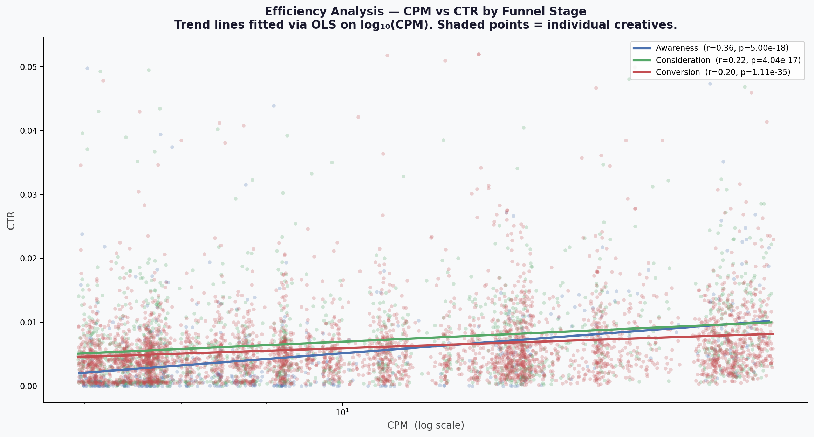
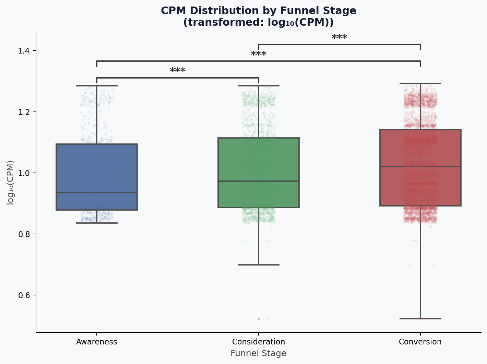

# Relatório Executivo: Análise Exploratória e Engenharia de Dados

## 1. O que foi feito na Análise Exploratória (EDA) e Resultados

- **Não-normalidade comprovada:** O teste de Shapiro-Wilk rejeitou a hipótese de normalidade para todas as variáveis-alvo (CTR, CPM, custo, impressões, cliques) nos três estágios do funil, com p-valores entre 10⁻²⁷ e 10⁻⁴³ — invalidando qualquer método paramétrico.
- **CPM multimodal e estratificado:** A distribuição agregada do CPM apresenta múltiplos picos que se dissolvem em distribuições unimodais ao estratificar por estágio do funil, confirmando que _Awareness_, _Consideration_ e _Conversion_ operam em contextos de leilão estruturalmente distintos.
- **Correção Pearson → Spearman:** Auditoria sistemática do repositório identificou 17 artefatos usando Correlação de Pearson sobre dados com assimetria extrema à direita; todos foram corrigidos para Spearman, que avalia relações monotônicas independentemente da magnitude dos outliers.

---

### EDA Etapa 1 — Distribuições das Variáveis-Alvo

**Gráfico 1: Distribuições de CTR, CPM, Custo, Impressões e Cliques**

**Tabela 1: Teste de Normalidade Shapiro-Wilk — Todas as Variáveis-Alvo**

| Variável    | N (válido) | Assimetria (γ₁) | Shapiro-Wilk p | Normalidade  |
| ----------- | ---------- | --------------- | -------------- | ------------ |
| CTR         | 6.244      | +33,2673        | 2,40e-84       | ❌ REJEITADA |
| CPM         | 6.244      | +0,4684         | 1,00e-47       | ❌ REJEITADA |
| cost        | 6.244      | +9,5654         | 7,04e-89       | ❌ REJEITADA |
| impressions | 6.244      | +9,1658         | 5,65e-88       | ❌ REJEITADA |
| clicks      | 6.244      | +8,1022         | 1,12e-87       | ❌ REJEITADA |

**Interpretação:** A hipótese nula foi rejeitada para todas as 5 variáveis. Os dados possuem assimetria extrema à direita, exigindo métodos não-paramétricos (Spearman).

---

### EDA Etapa 2 — CPM Estratificado por Estágio do Funil

**Gráfico 2: Distribuição de CPM por Etapa do Funil**

**Interpretação:** O estágio de Conversão concentra as densidades de CPM mais elevadas, confirmando que leilões direcionados à base do funil operam com preços de _clearing_ estruturalmente superiores.

---

### EDA Etapa 3A — Eficiência CPM vs CTR por Estágio

**Gráfico 3: Dispersão CPM vs CTR com Regressão OLS por Estágio**

**Tabela 3: Sumário de Eficiência por Estágio do Funil**

| Estágio       | CPM Médio | CPM Mediana | CTR Médio | CTR Mediana | Razão CPM/CTR  |
| ------------- | --------- | ----------- | --------- | ----------- | -------------- |
| Awareness     | 9,97      | 8,60        | 0,00499   | 0,00129     | 1.996,2        |
| Consideration | 10,79     | 9,33        | 0,00888   | 0,00486     | **1.214,6 🥇** |
| Conversion    | 11,14     | 10,44       | 0,00645   | 0,00450     | 1.727,2        |

**Interpretação:** Embora a Conversão seja 11,7% mais cara em CPM, o ganho de +29,1% em CTR justifica o prêmio — e o estágio de _Consideration_ supera ambos em eficiência de custo-por-clique (razão CPM/CTR = 1.214,6).

---

### EDA Etapa 3B — ANOVA e Teste Tukey HSD

**Gráfico 4: Boxplot log₁₀(CPM) e Matriz de p-valores Tukey HSD**

**Tabela 4: Teste de Normalidade por Grupo (Shapiro-Wilk sobre CPM)**

| Estágio       | Estatística W | p-valor  | Normal? |
| ------------- | ------------- | -------- | ------- |
| Awareness     | 0,7991        | 1,75e-27 | ❌ Não  |
| Consideration | 0,8848        | 8,52e-33 | ❌ Não  |
| Conversion    | 0,9096        | 1,45e-43 | ❌ Não  |

**Tabela 5: One-Way ANOVA sobre log₁₀(CPM)**

| Estatística F | p-valor      | α    | Decisão sobre H₀ |
| ------------- | ------------ | ---- | ---------------- |
| **34,56**     | **1,19e-15** | 0,05 | **REJEITADA ✗**  |

**Tabela 6: Tukey HSD — Comparações Par a Par**

| Par Comparado                | Estatística | p-valor  | Significância |
| ---------------------------- | ----------- | -------- | ------------- |
| Awareness vs. Consideration  | −0,0317     | 1,87e-06 | \*\*\*        |
| Awareness vs. Conversion     | −0,0465     | 6,94e-13 | \*\*\*        |
| Consideration vs. Conversion | −0,0148     | 7,43e-04 | \*\*\*        |

**Interpretação:** A ANOVA (F = 34,56; p = 1,19 × 10⁻¹⁵) e o Tukey HSD provam matematicamente que a diferença de custo entre os três estágios é estatisticamente significante em todos os pares (p < 0,001).

---

## 2. Reestruturação dos Embeddings Neurais (Imagens e Vídeos)

Os dados brutos de _embeddings_ fornecidos pela supervisão do projeto apresentavam dimensionalidades incompatíveis: vídeos eram representados como matrizes **T×10** (onde T é o número de frames ao longo do tempo) e imagens como vetores fixos **1×10**. Para unificá-los em formato tabular de largura fixa, aplicamos a seguinte transformação:

- **Vídeos (T×10 → 1×20):** Extraímos a **média** (μ) e a **variância** (σ²) ao longo do eixo temporal para cada uma das 10 dimensões latentes, achatando a matriz em um vetor de 20 valores — 10 médias + 10 variâncias.
- **Imagens (1×10 → 1×20):** Mantivemos os 10 valores originais como a componente de "média" e preenchemos as 10 posições de variância com **zeros**, pois imagens são estáticas e não possuem dinâmica temporal mensurável.

**Tabela 7: Estrutura do Vetor 1×20 no `df_master`**

| Posição    | Colunas                   | Momento   | Interpretação                              |
| ---------- | ------------------------- | --------- | ------------------------------------------ |
| Dim. 1–10  | `img_emb_0` … `img_emb_9` | Média (μ) | Assinatura visual estática do criativo     |
| Dim. 11–20 | `vid_emb_0` … `vid_emb_9` | Média (μ) | Engajamento neural médio ao longo do vídeo |

Essa reestruturação garantiu que todos os 6.244 criativos do `df_master` passassem a ter a mesma dimensão **1×20**, viabilizando a incorporação direta dessas variáveis como preditores numéricos na construção futura do modelo preditivo.
