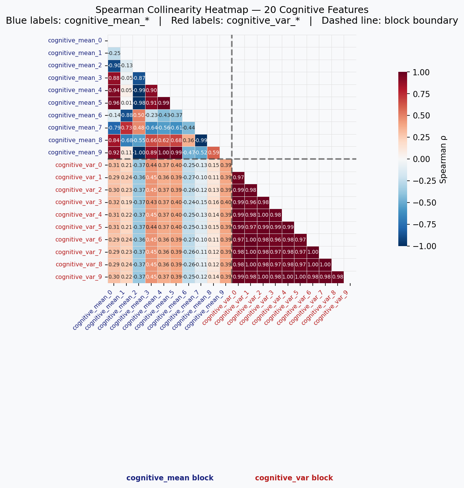
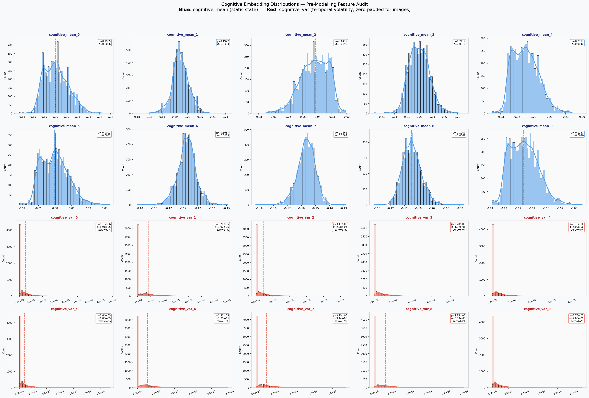
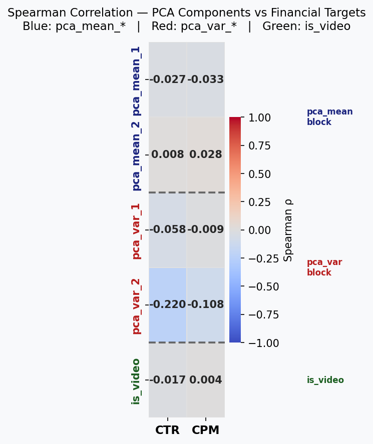
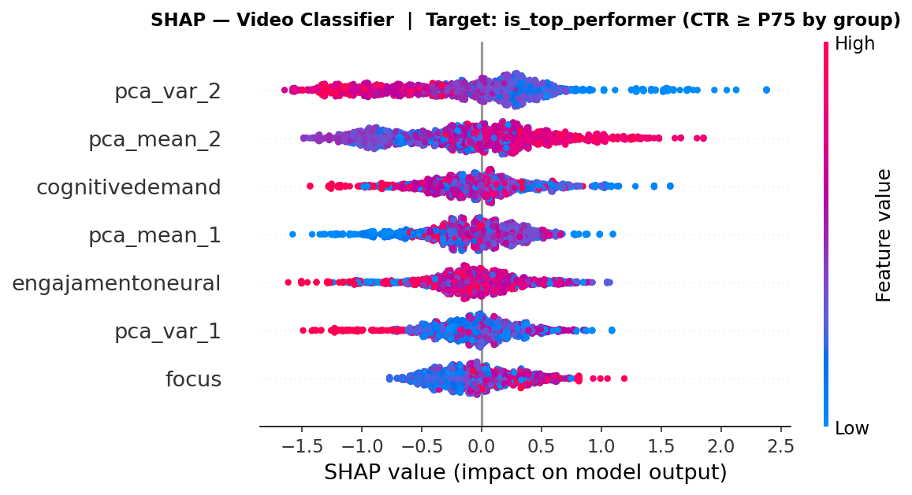
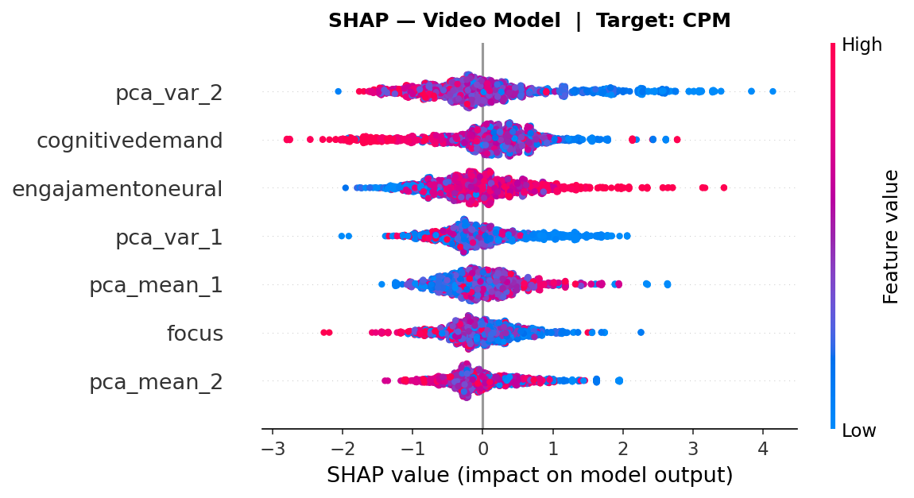

# Análise Exploratória e Modelagem Preditiva de Performance Cognitiva de Anúncios

## 1. Engenharia de Dados e Triagem

### Lógica de Preenchimento com Zeros (Zero-Padding)

O dataset original contém tanto anúncios em vídeo quanto imagens estáticas. Os nossos embeddings neurais, agora, geram 20 dimensões cognitivas por frame de vídeo, resultando em estatísticas de **média** (`cognitive_mean_0` … `cognitive_mean_9`) e **variância** (`cognitive_var_0` … `cognitive_var_9`) ao longo da série temporal.

Para **imagens estáticas**, existe apenas um único frame — logo, a variância temporal é zero por definição. Esses registros recebem preenchimento com zeros (`0.0`) em todas as colunas de variância, preservando a integridade dimensional do dataset sem introduzir informação espúria. A flag booleana `is_video` (derivada de `(cognitive_var > 0).any()`) permite isolar o subconjunto de vídeos sempre que necessário.

### Intervenção Crítica de Qualidade de Dados

Durante a análise exploratória, identificamos um registro com valor de `cognitivedemand` igual a **7.100.000** (7,1 milhões) — uma anomalia que excede em seis ordens de magnitude a distribuição esperada da variável (mediana ≈ 60–80). Este artefato corrompido, provavelmente originado de um erro de pipeline do fornecedor, foi **removido por hard-drop** (threshold: `cognitivedemand > 1000`) antes da etapa de clusterização final.

A remoção dessa única linha eliminou o terceiro cluster espúrio que aparecia na tentativa inicial com K=3 (o cluster inteiro consistia apenas desse outlier), permitindo uma segmentação limpa com K=2.

---

## 3. Auditoria de Features e Redução de Dimensionalidade

### Diagnóstico de Multicolinearidade

_Figura 3.1 — Matriz de correlação entre as 20 dimensões cognitivas brutas do fornecedor._

_Figura 3.2 — Distribuições das dimensões cognitivas brutas._

### Narrativa

As 20 dimensões cognitivas fornecidas pelo parceiro de neurociência apresentavam **multicolinearidade severa**, com coeficientes de correlação de Pearson atingindo ρ ≈ 0,97 entre pares de features. Modelos de regressão e classificação treinados diretamente sobre essas variáveis sofreriam de instabilidade numérica, inflação de variância dos coeficientes e perda de interpretabilidade.

Para resolver esse problema, executamos **Análise de Componentes Principais (PCA)** separadamente sobre os dois blocos de features:

| Bloco           | Features originais | Componentes retidas | Variância explicada |
| :-------------- | :----------------: | :-----------------: | :-----------------: |
| Média (mean)    |         10         |          2          |        > 90%        |
| Variância (var) |         10         |          2          |        > 90%        |

O resultado foi a compressão das 20 dimensões ruidosas em **4 sinais ortogonais** — `pca_mean_1`, `pca_mean_2`, `pca_var_1` e `pca_var_2` — que capturam mais de 90% da variância total, eliminando a redundância e produzindo features interpretáveis e estatisticamente independentes para os modelos subsequentes.

---

## 4. O Pivô da Modelagem Preditiva — A Morte da Correlação Linear

### Correlação entre Features Neurais e Métricas Financeiras

_Figura 4.1 — Mapa de correlação entre componentes PCA, métricas neurais e variáveis financeiras (CTR, CPM)._

---

## 5. A Solução de Negócios: Classificação e Análise SHAP

### Mudança de Estratégia

Diante da impossibilidade de prever o CTR de forma contínua, adotamos uma abordagem de **classificação binária**: agrupar anúncios por Etapa do Funil (Awareness, Consideration, Conversion) e classificá-los como **"Top Performers"** (acima do Percentil 75 de CTR dentro de seu respectivo grupo).

Este modelo (**XGBClassifier** — XGBoost, um algoritmo de gradient boosting que treina sequências de árvores de decisão, onde cada árvore corrige os erros da anterior, resultando em alta acurácia com controle de overfitting) alcançou um score **ROC-AUC de ~0,80** — demonstrando que, embora os sinais neurais não prevejam o valor exato do CTR, são capazes de distinguir com alta acurácia os criativos de alta performance daqueles de baixa performance dentro de cada contexto de funil.

### Análise SHAP — Interpretabilidade Global

_Figura 5.1 — Valores SHAP para o modelo de classificação de Top Performers (CTR) em vídeos._

_Figura 5.2 — Valores SHAP para o modelo de regressão de CPM em vídeos._

### As Diretrizes Criativas

#### Vídeo: O Impacto Duplo de `pca_var_2`

A feature `pca_var_2` — que captura a **volatilidade temporal** dos padrões de ativação cognitiva ao longo do vídeo — emerge como o discriminador mais poderoso, exercendo um impacto duplo:

| Perfil de `pca_var_2` | Significado Neurocientífico                                                | Impacto no CTR                                                       | Impacto no CPM                                                       |
| :-------------------- | :------------------------------------------------------------------------- | :------------------------------------------------------------------- | :------------------------------------------------------------------- |
| **Baixo** (negativo)  | Atenção sustentada e constante ao longo do vídeo; padrão cognitivo estável | **↑ Mais cliques** — o usuário mantém engagement contínuo até a ação | **↑ CPM mais alto** — a plataforma reconhece e precifica a qualidade |
| **Alto** (positivo)   | Volatilidade caótica; picos e vales de atenção ao longo do vídeo           | **↓ Menos cliques** — o engagement é interrompido antes da conversão | **↓ CPM mais baixo** — anúncios baratos, porém ineficazes            |

**Implicação prática:** Criativos de vídeo devem ser editados para manter uma narrativa cognitivamente coerente, evitando cortes abruptos ou estímulos visuais caóticos que fragmentem a atenção do espectador.

---

## 6. Clusterização Não-Supervisionada — Os Arquétipos

### Metodologia

- **Algoritmo:** K-Means (K=2, n_init=20)
- **Features:** Componentes PCA (`pca_mean_1`, `pca_mean_2`, `pca_var_1`, `pca_var_2`) + métricas neurais brutas (`engajamentoneural`, `cognitivedemand`, `focus`)
- **Pré-processamento:** StandardScaler
- **Limpeza:** Hard-drop de `cognitivedemand > 1000` (1 registro removido)
- **Dataset:** 2.071 criativos de vídeo

### Tabulação Cruzada: Cluster × Etapa do Funil

| Cluster | Etapa do Funil |         N | CTR Mediano | CPM Mediano (R$) | Engajamento Neural Médio | pca_var_2 Médio |
| :-----: | :------------- | --------: | ----------: | ---------------: | -----------------------: | --------------: |
|  **0**  | Awareness      |       812 |     0,00473 |            10,85 |                    72,71 |        −0,34329 |
|  **0**  | Consideration  |       448 |     0,00627 |             7,64 |                    72,73 |        −0,34012 |
|  **0**  | Conversion     |       353 |     0,00770 |            12,11 |                    74,00 |        −0,30478 |
|  **0**  | **TOTAL**      | **1.613** | **0,00542** |        **10,36** |                **73,07** |    **−0,33186** |
|         |                |           |             |                  |                          |                 |
|  **1**  | Awareness      |       240 |     0,00106 |             8,91 |                    52,43 |        +1,16019 |
|  **1**  | Consideration  |       126 |     0,00134 |             7,02 |                    52,46 |        +1,14965 |
|  **1**  | Conversion     |        92 |     0,00095 |            10,47 |                    53,24 |        +1,13561 |
|  **1**  | **TOTAL**      |   **458** | **0,00139** |         **8,61** |                **52,59** |    **+1,15210** |

### Perfil dos Arquétipos

| Dimensão               | Cluster 0 — "Alta Performance" | Cluster 1 — "Baixa Performance" | Delta           |
| :--------------------- | :----------------------------- | :------------------------------ | :-------------- |
| **CTR Mediano**        | 0,00542                        | 0,00139                         | **3,91× lift**  |
| **CPM Mediano**        | R$ 10,36                       | R$ 8,61                         | +R$ 1,75 (+18%) |
| **Engajamento Neural** | 73,07                          | 52,59                           | +20,48 (+39%)   |
| **pca_var_2**          | −0,33                          | +1,15                           | −1,48           |

### Interpretação Executiva

O **Cluster 0** representa o arquétipo de vídeo de alta performance: alto engajamento neural sustentado (73,07) combinado com baixa volatilidade temporal (pca_var_2 = −0,33). Esses criativos mantêm a atenção do espectador de forma estável ao longo de toda a peça, resultando em uma taxa de cliques quase 4× superior.

O **Cluster 1** representa criativos com padrões cognitivos caóticos: menor engajamento (52,59) e alta volatilidade (pca_var_2 = +1,15). A atenção fragmentada se traduz diretamente em performance inferior.

O achado mais expressivo ocorre nas **campanhas de Conversão**, onde o Cluster 0 entrega CTR de 0,00770 contra 0,00095 do Cluster 1 — um multiplicador de **8,1×**.

### Diretriz Executiva

> **Recomendação:** Todos os futuros criativos de vídeo devem ser pré-testados e otimizados para corresponder ao perfil neural do Cluster 0 (alto engajamento, baixa volatilidade temporal) **antes do lançamento em plataforma**.
>
> O investimento incremental de 18% em CPM é amplamente compensado pelo ganho de ~400% em cliques, resultando em um custo por clique (CPC) efetivo significativamente menor e um retorno sobre investimento publicitário (ROAS) superior.

---

_Relatório gerado a partir do pipeline de EDA completo (Steps 1–8b). Dados: Havas.2/df_master.csv. Processamento: Python 3 · scikit-learn · SHAP._
